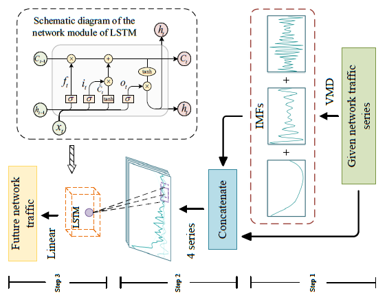








# 🏃 About me

I am a senior undergrad student [Nanfang College of Sun Yat-sen University](https://www.nfu.edu.cn/) in Guangzhou, China. My majoy is Intelligence Science and Technology. I was advised by [Prof. Choujun Zhan](https://scholar.google.com/citations?user=CQjEUkAAAAAJ) in [Research Institute of Big Data and Artificial Intelligence (RIBDAI)](https://www.labxing.com/gnfc-ai-lab).I have conducted interdisciplinary research in atmospheric science and machine learning at [3D Space Ltd.](http://xn--ehq269cgqo6ge.xn--fiqs8s/index.php?sn=solution&fid=51).My current research focuses on **time series analysis** . I work on applying artificial intelligence to industry and public health. I am looking for a **RA/PHD** position starting in the 2024 fall. Please feel free to contact me by email. for details, please view my curriculum vitae.

You can find my CV here: [Fabing's Curriculum Vitae](images/LFB_Academic_en_20230502.pdf).

# 🔥 News
- *2023.05*: &nbsp;🎉 A conference paper were published on [2023 IEEE International Symposium on Circuits and Systems (ISCAS)](https://iscas2023.org/)
- *2023.04*: &nbsp; [3D-space Co., Ltd.](http://xn--ehq269cgqo6ge.xn--fiqs8s/index.php?sn=solution&fid=51) conducts interdisciplinary research on atmospheric science and machine learning.Practice
- *2022.11*: &nbsp;🔥 A Journal Paper were published in the Journal [Neural Computing and Applications](https://www.springer.com/journal/521)
- *2022.11*: &nbsp;📖 A conference paper were published on [2022 IEEE International Symposium on Product Compliance Engineering-Asia(ISPCE-AS)](https://dl2link.com/ISPCE-AS2022/) 
- *2021.08*: &nbsp; A conference paper were published on 2021 International Conference on Neural Computing for Advanced Applications (NCAA)

--- 
 
# 📝 Publications

## Journal Papers

NCAA

  
[A decomposition-ensemble broad learning system for AQI forecasting.](https://link.springer.com/article/10.1007/s00521-022-07448-2)

Choujun Zhan,Wei Jiang,**Fabing Lin**, Shuntao Zhang, Bing Li

[**Project**](https://scholar.google.com/citations?view_op=view_citation&hl=zh-CN&user=wnSqZjMAAAAJ&citation_for_view=wnSqZjMAAAAJ:2osOgNQ5qMEC) <strong>Neural Computing and Applications</strong>
- A Research Paper at the Intersection of Atmospheric Science and Machine Learning.

- Analysis of the main influencing factors affecting the transmission of the COVID-19 pandemic.(**Contributing**)[IEEE journal of Biomedical and Health Informatics](https://ieeexplore.ieee.org/xpl/RecentIssue.jsp?punumber=6221020),Choujun Zhan,**Fabing Lin**,Kaihan Wu,Tse.K,**[IEEE journal of Biomedical and Health Informatics.](https://ieeexplore.ieee.org/xpl/RecentIssue.jsp?punumber=6221020)**

---

## Conference Papers

- [Broad learning system based on Savitzky–Golay filter and variational mode decomposition for short-term load forecasting](https://ieeexplore.ieee.org/abstract/document/9970794),Hu Min,**Fabing Lin**,Kaihan Wu,Junhui Lu,Zhengyang Hou,Choujun Zhan,[IEEE International Symposium on Product Compliance Engineering-Asia.](https://dl2link.com/ISPCE-AS2022/)

ISCAS

  
A Realistic Network Traffic Forecasting Method Based on VMD and LSTM Network.

Kaihan Wu,Junhui Lu,**Fabing Lin**,Yao Huang,Choujun Zhan

[**Project**](None) <strong>International Symposium on Circuits and Systems</strong>
- A Study on Network Traffic Communication Prediction.

NCAA

  
[Empirical Mode Decomposition Based Deep Neural Networks for AQI Forecasting.](https://link.springer.com/chapter/10.1007/978-981-16-5188-5_54)

Wei Jiang,Yuxia Fu,**Fabing Lin**,Jing Liu,Choujun Zhan

[**Project**](https://scholar.google.com/citations?view_op=view_citation&hl=zh-CN&user=wnSqZjMAAAAJ&citation_for_view=wnSqZjMAAAAJ:UeHWp8X0CEIC) <strong>Neural Computing and Applications</strong>
- A research in the interdisciplinary field of deep learning and atmospheric science.

---

# 🏆 Honors and Awards
- *2023.05* &nbsp;🎉 Excellent Bachelor Thesis.
- *2022 - 2023*  National College Students' Innovative Entrepreneurial Training Plan Program, Network traffic forecasting system based on deep learning, Principal, Leader.
- *2022* &nbsp;🔥 Software copyright, User Adaptive Preference Recommendation System Based on Graph Neural Network.
- *2022.10*  Third prize in 2022 China Undergraduate Mathematical.
- *2021 - 2022*  National College Students' Innovative Entrepreneurial Training Plan Program, Based on the graph neural network user adaptive preference recommendation system,participant。
- *2021 - 2022* &nbsp;💻 Third prize Scholarship(awarded to the top 21 %)。
- *2021.10*  Third prize in 2021 China Undergraduate Mathematical  Contest in Modeling
- *2020* &nbsp;📖 Software copyright, Data Analysis and Prediction System of Chinese Movie Box Office Based on Machine

# 📖 Work Experience
- *2023.04-2023.06*, &nbsp;☁️ [3D-space Co., Ltd.](http://xn--ehq269cgqo6ge.xn--fiqs8s/index.php?sn=solution&fid=51) conducts interdisciplinary research on atmospheric science and machine learning.

---

# ✏️ Projects

I am interested in **Time-series**, **Machine learning**, **Deep learning**,**Causal analysis**. My current focuses include:
- Time series prediction modeling.
- Time Series Causal Analysis.
- Atmospheric Science and Machine Learning Interdisciplinary.
- Interdisciplinary of Medicine and Machine Learning.

## 🌱1.Time Series Causality Studies: Infectious Disease Dynamics

### Analysis of the main influencing factors affecting the transmission of the COVID-19 pandemic.

#### Research significance and aim:

Based on an interpretable machine learning model driven by big data, a correlation model between multiple factors and the epidemic is constructed to help researchers explore treatment methods and assist policy decision makers in making public health decisions.

#### 🍃Research achievements:

1. Using machine learning and integrated learning models, a total of 10 models are used to model and analyze multi-factor data and epidemic data, aiming at different A total of more than 100 machine learning combinations have been constructed in the application scenarios, and more than 10,000 hyperparameter combination optimizations have been tried for each type of machine learning.A general model and seventy-six precise models were obtained, and the R-Squared of the model reached 0.9.
2. The machine learning model constructed in a variety of application scenarios is based on SHAP (SHapley Additive exPlanations) to build an interpretable learning analysis system, which quantifies the impact of different factors on the spread of the epidemic and calculates the impact of multiple factors on the spread of the epidemic.

### Glomerular Filtration Rate Analysis.

#### 📄Research significance and aim:

This project cooperates with the Third Affiliated Hospital of Sun Yat-sen University. The glomerular filtration rate is one of the important indicators to measure renal function. The accurate modeling analysis and prediction of the glomerular filtration rate can quickly judge the patient's physical condition from Treat it.

#### 🔥Research achievements: 

1. In cooperation with the Third Affiliated Hospital of Sun Yat-sen University to study glomerular filtration rate (mGFR) modeling, we collected and sorted out the physical condition and various  index data of more than 3,000 patients. Organize it into a usable dataset.
2. Modeling using machine learning and ensemble learning to predict eGFR (predicted mGFR), and The New England Journal of Medicine (The New England Journal of Medicine, NEJM)’s same subject research "New Creatinine- and Cystatin C–Based Equations to Compared with "Estimate GFR without Race", our method has higher model accuracy in the patient data of Sun Yat-Sen Third Hospital. In actual application scenarios, it can enable patients to diagnose diseases with the least cost.

## 🌱2. Time Series Forecasting

### A decomposition-ensemble broad learning system for AQI forecasting.

#### 🍀Research significance and aim:

Building an air quality prediction model based on statistics and machine learning provides a scientific and reasonable basis for air pollution prevention and effective measures Theoretical basis.

#### 🌾Research achievements:

1. Based on the collection of air quality factors based on web crawler technology, a daily timing crawler is used to construct a dataset, which includes the period from 2019 to 2021 The air quality data of more than 3,000 sites in China in 2019.
2. Combining empirical mode decomposition and its derivative methods with machine learning, an improved machine learning model Decompositionensemble is proposed BLS solves the problem that the original features do not contain frequency domain features, and the final results of the experiment are compared with other 24 machines with a single feature. Machine learning modeling, the proposed method has the effect of improving the accuracy of the model in the predictive modeling of air quality.

### Broad learning system based on Savitzky–Golay filter and variational mode decomposition for short-term load forecasting

#### ❄️Research significance and aim: 

The new crown epidemic has dealt a huge blow to the economy of the world, especially the electricity market. The forecast can judge the future market economic trend. In this regard, we have constructed machine learning and neural network models for short-term forecasting of electricity consumption. This is of great significance for the power sector to formulate energy plans and ensure the safe operation of the power system.

#### 🍀Research achievements:

1. Using web crawler technology to collect electricity data, oil price data, new crown epidemic data and night light intensity data of cities such as New York City in the United States from 2017 to the present, analyze and integrate them, and build a dataset.
2. An error correction model for time-invariant systems is proposed to fit the data with high precision, which can be applied to various scenarios

---

# 💬 Invited Talks
- *2022.11*, ["Broad learning system based on Savitzky–Golay filter and variational mode decomposition for short-term load forecasting."](https://ieeexplore.ieee.org/abstract/document/9970794) at [ISPCE-AS 2022](https://dl2link.com/ISPCE-AS2022/")

# 📄 Services

- Nov 2021,Best Volunteer Team of [IEEE International Symposium on Product Compliance Engineering-Asia (ISPCE-AS 2022)](https://dl2link.com/ISPCE-AS2022)
- ✏️Aug 2021, Volunteer of [International Conference on Neural Computing for Advanced Applications 2021 (NCAA 2021)](https://dl2link.com/ncaa2021/)
- Mar 2019 - Present, Research Assistant of [Research Institute of Big Data and Artificail Intelligence (RIBDAI)](https://www.labxing.com/gnfc-ai-lab), Nanfang College of Sun Yat-sen University in Guangzhou

